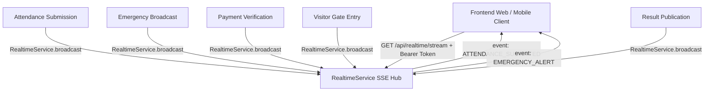

# Real-Time Operational Event Streaming Architecture

## 1. Architecture Overview
The platform uses **Server-Sent Events (SSE)** via HTTP/2 and standard HTTP persistent connections for real-time institutional event broadcasting.

---

## 2. Event Types & Payloads

| Event Name | Triggering Module | Target Audience | Payload Attributes |
|:---|:---|:---|:---|
| `EMERGENCY_ALERT` | Emergency Platform | All / Filtered | `id`, `title`, `message`, `priority`, `sentAt`, `creator` |
| `CAMPUS_STATUS_CHANGED` | Security / Principal | All | `status`, `reason`, `updatedBy`, `updatedAt` |
| `ATTENDANCE_SUBMITTED` | Faculty Roll Call | Class Coordinator, HOD | `slotId`, `classId`, `sectionId`, `date`, `presentCount` |
| `PAYMENT_RECEIVED` | Finance & Fees | Office Admin, Guardian | `paymentNumber`, `studentId`, `amount`, `status` |
| `RESULT_PUBLISHED` | Examination Engine | Student, Guardian | `examinationId`, `classId`, `academicYearId` |
| `VISITOR_ENTERED` | Gate Security | Host Staff User | `passNumber`, `visitorName`, `hostUserId`, `entryTime` |

---

## 3. Reconnection & Idempotency
- SSE automatically reconnects with standard EventSource retry headers (`retry: 15000`).
- Disconnections are cleaned up automatically on socket `close` events.
- All real-time event updates are idempotent on client state without requiring full-page reload.
