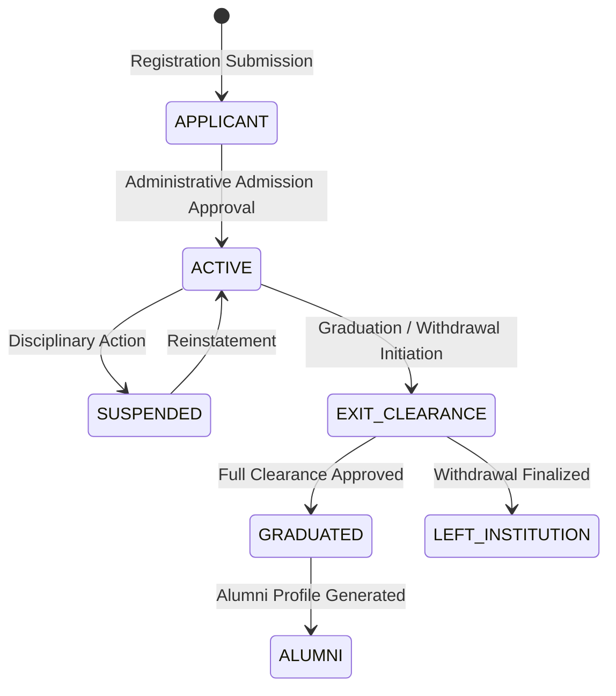

# Student Lifecycle & Alumni Management Guide

## Student State Machine

## Exit Clearance Requirements
Before updating a student's status to `LEFT_INSTITUTION` or `GRADUATED`, the system requires verification of:
1. **Fee Clearance**: Zero outstanding tuition or hostel dues.
2. **Library Clearance**: All issued volumes returned or reconciled.
3. **Asset Clearance**: Laboratory equipment or sports gear returned.
4. **Document Clearance**: Transfer certificates and academic transcripts issued.
5. **ID Card Surrender**: Physical identification returned.
