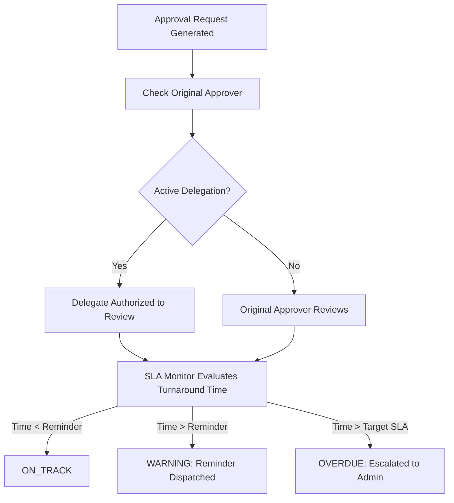

# Workflow & SLA Engine Guide

## Architecture
The Workflow & SLA Engine governs institutional approval chains, automated operational escalations, and temporary delegation of authority.

## Delegation Lifecycles
- Delegations have a defined validity window (`startDate` to `endDate`).
- A delegation can be revoked immediately by the grantor or Super Admin.
- The system checks both grantor ID and delegate ID when evaluating RBAC permissions for approvals.

## SLA Configuration Schema
| Field | Type | Description |
|:---|:---|:---|
| `workflowType` | String | e.g. `USER_APPROVAL`, `GENERIC_APPROVAL`, `STUDENT_EXIT` |
| `targetHours` | Integer | Hard turnaround deadline (e.g. 48 hours) |
| `reminderHours` | Integer | Warning window triggering alerts (e.g. 24 hours) |
| `escalateToRole` | String | Role receiving breach notifications (e.g. `SUPER_ADMIN`) |
